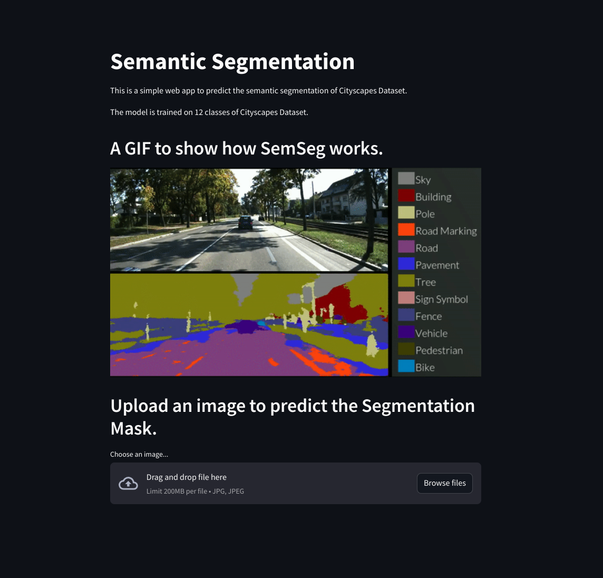

# Minor Project - 3  >> Visual Computing Lab

* Semantic Segmentation for 12 Classes

## Aaditya Baranwal

* B20EE001

### Dataset

>> The dataset is cityscapes128. The link to the dataset is given below:  
[Dataset](https://drive.google.com/u/0/uc?id=1XUWaL2ijz1vjbKbxJ6TYkG4QZgIsiZu_&export=download)

### WebAPP

 

### Report

[Document](assets/report.pdf)
